<!-- ==================== Header Badges ==================== -->

  
  
  

<!-- ==================== Banner ==================== -->

<!-- ==================== Typing Animation ==================== -->

  

 

<!-- ==================== About Me ==================== -->
##  About Me

- 👋 Hi, I'm **KD-CHL**, a full-stack developer from China 🇨🇳
- 💡 I enjoy building products from idea to deployment — backend APIs, interactive frontends, and everything in between
- 🤖 Currently exploring **AI Agent Systems**, **full-stack web apps**, and **interactive learning tools**
- 📦 Maintainer of [AgentSystem](https://github.com/KD-CHL/agentsystem), [ContractAI](https://github.com/KD-CHL/ContractAI), [LearnGit](https://github.com/KD-CHL/learngit) and more
- 🎯 Motto: *Code is poetry written in logic.*

 

<!-- ==================== Tech Stack ==================== -->
##  Tech Stack

| Category | Technologies |
|----------|-------------|
| **Languages** |    |
| **Backend** |    |
| **Frontend** |     |
| **Database** |    |
| **DevOps & Tools** |      |
| **Visualization** |   |

 

<!-- ==================== GitHub Stats ==================== -->
##  GitHub Stats

  
  

  

 

<!-- ==================== Contribution Graph Snake ==================== -->
##  Contribution Activity

 

<!-- ==================== 3D Contribution Graph ==================== -->

  

 

<!-- ==================== Open Source ==================== -->
##  Open Source

  
  
  

> *"Any fool can write code that a computer can understand. Good programmers write code that humans can understand."* — Martin Fowler

 

<!-- ==================== Game Zone ==================== -->
##  Game Zone

  

  

  

 

<!-- ==================== Projects Showcase ==================== -->
##  Featured Projects

| Project | Description |
|---------|-------------|
| [AgentSystem](https://github.com/KD-CHL/agentsystem) | 🤖 AI Agent management platform — FastAPI + Vue 3 |
| [ContractAI](https://github.com/KD-CHL/ContractAI) | 📄 Intelligent contract review system — clause analysis & risk detection |
| [LearnGit](https://github.com/KD-CHL/learngit) | 🎮 Interactive Git learning game — 17 levels with achievements |
| [Mineradio](https://github.com/KD-CHL/Mineradio) | 🎵 Web radio application |
| [Knowledge Blog](https://github.com/KD-CHL/myblog) | 📝 Personal knowledge log blog — full-stack with admin panel |

 

<!-- ==================== Contact ==================== -->
##  Contact Me

  
  

 

---

  

  <b>Thanks for visiting! :heart:</b>
    
  

